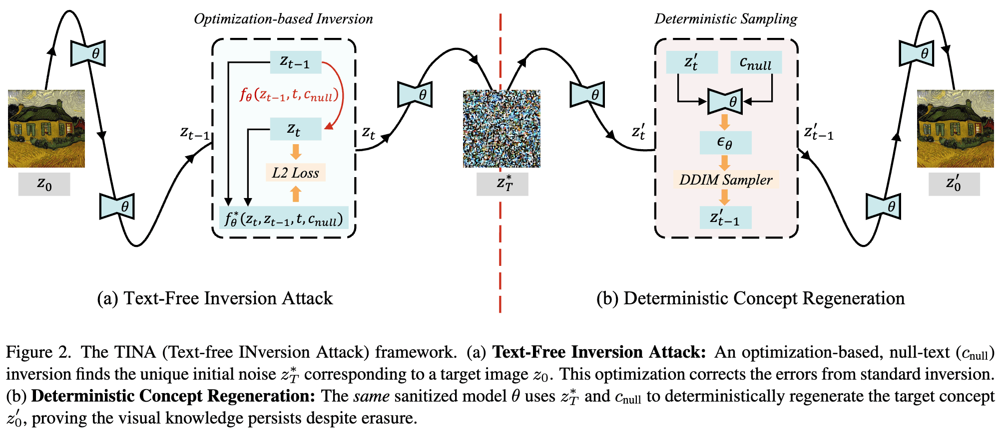

<div align="center">
<h2 align="center">
   <b>TINA: Text-Free Inversion Attack for Unlearned Text-to-Image Diffusion Models</b>
</h2>
<div>
Qianlong Xiang<sup>1,2,3</sup>,
Miao Zhang<sup>1&#9993;</sup>,
Haoyu Zhang<sup>1,4</sup>,
Kun Wang<sup>5</sup>,
Junhui Hou<sup>2</sup>,
Liqiang Nie<sup>1,3&#9993;</sup>
</div>
<sup>1</sup>Harbin Institute of Technology (Shenzhen)&nbsp;&nbsp;&nbsp;
<sup>2</sup>City University of Hong Kong&nbsp;&nbsp;&nbsp;
<sup>3</sup>Shenzhen Loop Area Institute&nbsp;&nbsp;&nbsp;
<sup>4</sup>Peng Cheng Laboratory&nbsp;&nbsp;&nbsp;
<sup>5</sup>Shandong University<br>
<sup>&#9993;</sup>Corresponding author&nbsp;&nbsp;<br>
<div align="center">
    <a href="https://arxiv.org/abs/2603.17828" target="_blank">
    </a>
</div>
</div>

## Method Overview

TINA (**T**ext-free **IN**version **A**ttack) is designed to bypass text-centric concept erasure defenses by directly optimizing a text-free inversion trajectory under the empty-text condition.

<p align="center">
  
</p>

## Main Experimental Result (Nudity ASR)

Attack Success Rate (ASR, %) on nudity erasure across 8 unlearning defenses:

| Attack Method | ESD | FMN | UCE | MACE | RECE | AdvUnlearn | SalUn | STEREO |
| --- | ---: | ---: | ---: | ---: | ---: | ---: | ---: | ---: |
| MMA | 13.10 | 67.00 | 32.60 | 6.00 | 22.80 | 1.70 | 1.70 | 5.50 |
| P4D | 69.01 | 97.89 | 76.06 | 75.35 | 66.20 | 18.31 | 15.49 | 24.65 |
| UDA | 76.05 | 97.89 | 78.87 | 81.69 | 63.38 | 23.24 | 13.38 | 25.35 |
| RAB | 50.53 | 97.89 | 29.47 | 6.32 | 10.53 | 2.11 | 0.00 | 8.42 |
| CCE | 74.65 | 54.93 | 49.30 | 50.00 | 66.90 | 76.76 | 2.82 | 16.90 |
| **TINA** | **82.39** | **97.89** | **82.39** | **92.96** | **80.28** | **78.87** | **71.13** | **80.99** |

TINA consistently achieves the strongest performance, including on robust defenses such as AdvUnlearn, SalUn, and STEREO.

## Environment

```bash
conda create -n tina python=3.10 -y
conda activate tina
pip install torch torchvision --index-url https://download.pytorch.org/whl/cu126 # we test on the version `torch=2.8.0+cu126, torchvision=0.23.0+cu126`
pip install terminaltables torchmetrics scipy opencv-python-headless pandas tqdm omegaconf
pip install diffusers["torch"]
pip install transformers==4.50.0
pip install accelerate
pip install git+https://github.com/Phoveran/fastargs.git@main#egg=fastargs
pip install git+https://github.com/CompVis/taming-transformers.git@master#egg=taming-transformers
pip install git+https://github.com/openai/CLIP.git@main#egg=clip
pip install onnxruntime-gpu
```

## Prepare ESD Checkpoint

You could download the ESD checkpoint from [AdvUnlearn repository](https://github.com/OPTML-Group/AdvUnlearn) and modify the path in `configs/*/*.json` file.

## Van Gogh Style Attack

**Generate Dataset**

```bash
CUDA_VISIBLE_DEVICES=0 python src/execs/generate_dataset.py --prompts_path prompts/vangogh.csv --concept vangogh --save_path files/dataset --model_name_or_path path/to/stable-diffusion-v1-4
```

**Download Artist Classifier**

The authors of [UnlearnDiffAtk](https://github.com/OPTML-Group/Diffusion-MU-Attack) provide an Artist classifier for evaluating the style task. You can download it from [here](https://drive.google.com/file/d/1me_MOrXip1Xa-XaUrPZZY7i49pgFe1po/view?usp=share_link). The resultant classifier should be placed in the `results/checkpoint-2800` directory.

**Attack**

```bash
for i in {0..49}; do
    CUDA_VISIBLE_DEVICES=0 python src/execs/attack.py --config-file configs/style/tina_esd_vangogh_classifier.json --attacker.attack_idx $i --logger.name attack_idx_$i
done
```

**Evaluation**

```bash
python scripts/analysis/style_analysis.py --root files/results/tina_esd_vangogh_classifier --top_k 1
```

## Nudity Attack

**Generate Dataset**

```bash
CUDA_VISIBLE_DEVICES=0 python src/execs/generate_dataset.py --prompts_path prompts/nudity.csv --concept i2p_nude --save_path files/dataset --model_name_or_path path/to/stable-diffusion-v1-4
```

**Prepare Results for No Attack**

```bash
for i in {0..141}; do
    CUDA_VISIBLE_DEVICES=0 python src/execs/attack.py --config-file configs/nudity/no_attack_esd_nudity_classifier.json --attacker.attack_idx $i --logger.name attack_idx_$i
done
```

**Attack**

```bash
for i in {0..141}; do
    CUDA_VISIBLE_DEVICES=0 python src/execs/attack.py --config-file configs/nudity/tina_esd_nudity_classifier.json --attacker.attack_idx $i --logger.name attack_idx_$i
done
```

**Evaluation**

```bash
export path_to_no_attack_results=files/results/no_attack_esd_nudity
export path_to_attack_results=files/results/tina_esd_nudity_classifier
python scripts/analysis/check_asr.py --root-no-attack $path_to_no_attack_results --root $path_to_attack_results
```

> Note: The script will print `failed to parse attack_idx_118` ~ `failed to parse attack_idx_141` and it **does not matter**. According to the code of [UnlearnDiffAtk](https://github.com/OPTML-Group/Diffusion-MU-Attack), idx 118 ~ 141 is excluded from the evaluation.

## Tench Attack

**Generate Dataset**

```bash
CUDA_VISIBLE_DEVICES=0 python src/execs/generate_dataset.py --prompts_path prompts/tench.csv --concept tench --save_path files/dataset --model_name_or_path path/to/stable-diffusion-v1-4
```

**Prepare Results for No Attack**

```bash
for i in {0..49}; do
    CUDA_VISIBLE_DEVICES=0 python src/execs/attack.py --config-file configs/object/no_attack_esd_tench_classifier.json --attacker.attack_idx $i --logger.name attack_idx_$i
done
```

**Attack**

```bash
for i in {0..49}; do
    CUDA_VISIBLE_DEVICES=0 python src/execs/attack.py --config-file configs/object/tina_esd_tench_classifier.json --attacker.attack_idx $i --logger.name attack_idx_$i
done
```

**Evaluation**

```bash
export path_to_no_attack_results=files/results/no_attack_esd_tench
export path_to_attack_results=files/results/tina_esd_tench_classifier
python scripts/analysis/check_asr.py --root-no-attack $path_to_no_attack_results --root $path_to_attack_results
```

## Acknowledgments

This repository is built upon the official codebase of [UnlearnDiffAtk](https://github.com/OPTML-Group/Diffusion-MU-Attack), and we express gratitude for their helpful released code.

## Citation

If you find our paper and repository helpful, please consider citing our paper:

```bibtex
@article{xiang2026tina,
  title={TINA: Text-Free Inversion Attack for Unlearned Text-to-Image Diffusion Models},
  author={Xiang, Qianlong and Zhang, Miao and Zhang, Haoyu and Wang, Kun and Hou, Junhui and Nie, Liqiang},
  journal={arXiv preprint arXiv:2603.17828},
  year={2026}
}
```
